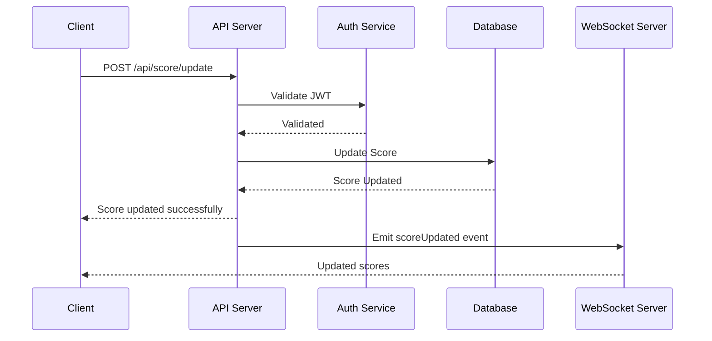

### Module Specification: Live Scoreboard API Service 

Table of Contents 
============
 
<!--ts-->
  * [Overview](#overview)
  * [Requirements](#requirements)
  * [Endpoints](#endpoints)  
    * [Update User Score](#update-user-score)
    * [Get Top Scores](#get-top-scores)
  * [Data Models](#data-models)  
    * [User](#user)
    * [Score](#score)
  * [Authentication & Authorization](#authentication--authorization)
  * [WebSocket Implementation](#websocket-implementation)
  * [Rate Limiting](#rate-limiting)
  * [Diagram](#diagram)
  * [Future Improvements](#future-improvements)
<!--te-->

Overview 
============

This module is designed to manage a live scoreboard for a website, allowing users to see real-time updates of the top 10 scores. Users can perform actions that increase their scores, and these updates should be reflected immediately on the scoreboard. Security measures are included to prevent unauthorized score manipulation.

Requirements 
============

1. Display a live scoreboard showing the top 10 users' scores.

2. Real-time updates of the scoreboard.

3. Increment user scores upon completion of specific actions.

4. Securely update scores to prevent unauthorized changes.

Endpoints 
============

### Update User Score 
 
- **Endpoint:**  `/api/score/update`
 
- **Method:**  `POST`
 
- **Description:**  Updates the user's score after an action is completed.
 
- **Request Body:** 

```json
{
  "userId": "string",
  "increment": "number"
}
```
 
- **Response:** 

```json
{
  "status": "success",
  "message": "Score updated successfully."
}
```
 
- **Authentication Required:**  Yes

### Get Top Scores 
 
- **Endpoint:**  `/api/score/top`
 
- **Method:**  `GET`
 
- **Description:**  Retrieves the top 10 scores.
 
- **Response:** 

```json
{
  "topScores": [
    { "userId": "string", "score": "number" },
    ...
  ]
}
```

Data Models 
============

### User 
 
- **Schema:** 

```typescript
interface User {
  userId: string;
  username: string;
  score: number;
}
```

### Score 
 
- **Schema:** 

```typescript
interface Score {
  userId: string;
  score: number;
}
```

Authentication & Authorization 
============
 
- **JWT (JSON Web Token)**  will be used to authenticate users.

- Each API request to update the score must include a valid JWT in the header.

WebSocket Implementation 
============
 
- **Socket.IO**  will be used for real-time communication.

- Clients will connect to the server via WebSocket to receive live updates of the scoreboard.
 
- Server will emit an event `scoreUpdated` with the updated top scores whenever a score is changed.

Rate Limiting 
============

- Implement rate limiting to prevent abuse of the score update endpoint.

- Each user can only update their score a limited number of times per minute.

Diagram 
============



Future Improvements 
============
 
- **Caching:**  Implement caching for the top scores to reduce database load.
 
- **Leaderboard Persistence:**  Store historical top scores for analytics.
 
- **Notifications:**  Add notification feature to inform users when they make it to the top 10.
 
- **User Activity Tracking:**  Track and analyze user actions leading to score increments for better insights.

Additional Comments 
============

- Ensure that the WebSocket connection is secure and authenticated.

- Consider using a message broker like RabbitMQ or Kafka for handling score updates and distributing them to the WebSocket server.

- Regularly audit the score update logs to detect and prevent potential abuse.


